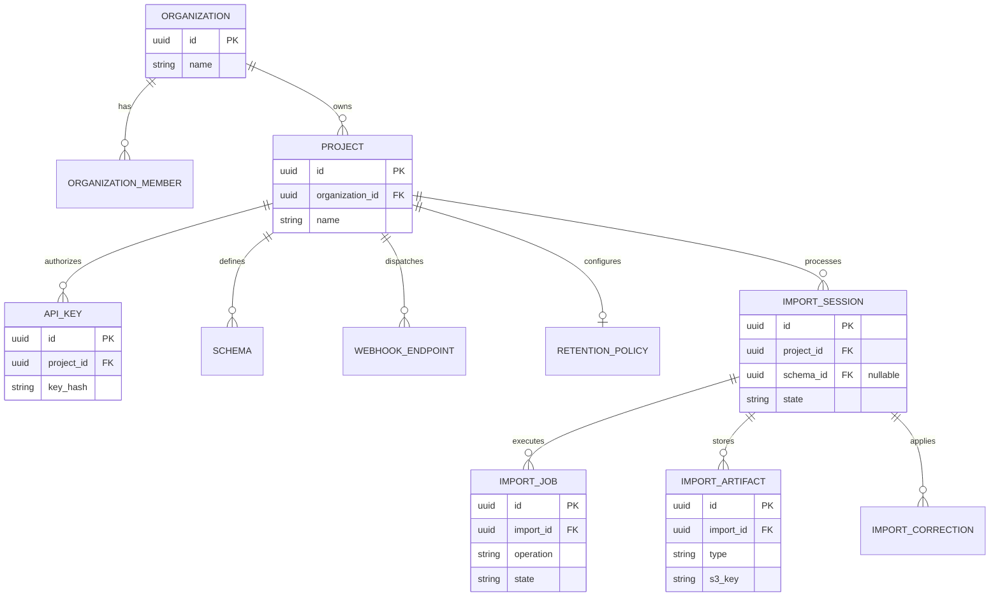

# ImportPilot Entity Relationship Diagram & Integrity Constraints

**Status:** Current  
**Date:** 2026-09-19 (Remediation)

## ERD (Mermaid)

## Database Integrity Constraints

1. **Foreign Key Cascades:**
   - `organizations` deletion cascades to `projects` and `organization_members`.
   - `projects` deletion cascades to `api_keys`, `schemas`, `webhook_endpoints`, and `import_sessions`.
   - `import_sessions` deletion cascades to `import_jobs`, `import_artifacts`, and `import_corrections`.

2. **Tenant Scoping Enforcement (Application Level):**
   - Opaque IDs (UUIDv7) are used for all primary keys.
   - Every API request targeting an `import_session`, `schema`, or `api_key` MUST implicitly filter by the authenticated `project_id` associated with the request token.

3. **Unique Constraints:**
   - `(project_id, schema_name)` must be unique.
   - `(import_id, attempt)` in `import_jobs` must be unique to prevent race condition duplicates.
